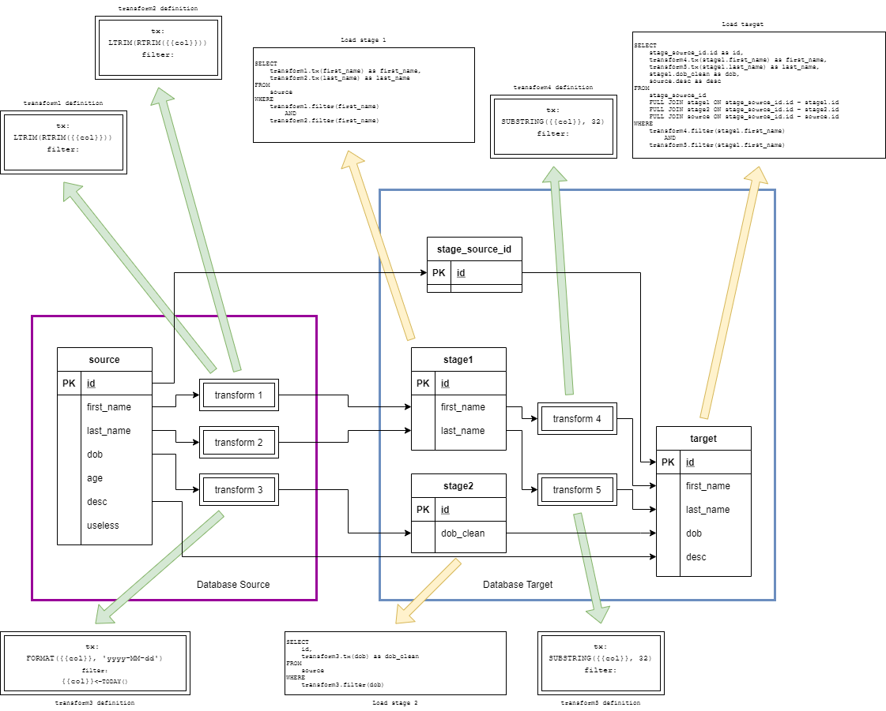
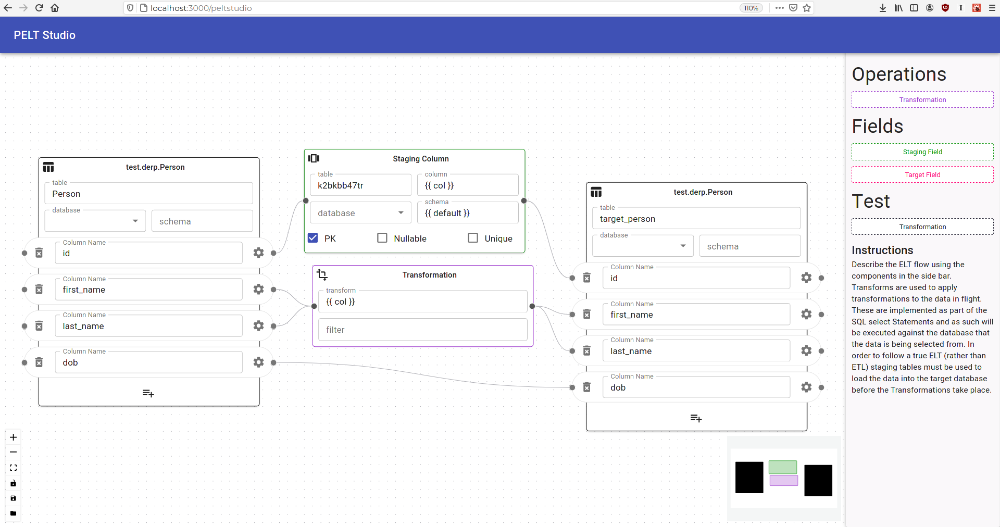

# PELT Studio

The **P**ython **E**xtract, **L**oad, **T**ransform Studio is an application for performing ELT (and ETL) tasks. Under the hood the application consists of a two parts. The Python back end: using SQLAlchemy for interfacing with traditional Relational Databases, FastAPI for exposing the logic to the fronend and Motor (async MongoDB client) for persisting the application configurations and database metadata. The front end is built using React and React-Flow from the Databricks project.



The above diagram serves as a basic explaination of what the MVC for this app strives to achieve. Current progress is shown below:



## Usage

```bash
# clone the repo and cd into it
git clone https://github.com/schlerp/pelt-studio.git
cd pelt-studio

# set up the python environment
python -m venv venv
source ./venv/bin/activate
python -m pip install -r requirements.txt

# start the app
python -m peltapi

# frontend: http://localhost:8321/peltstudio
# backend docs: http://localhost:8321/docs
```
