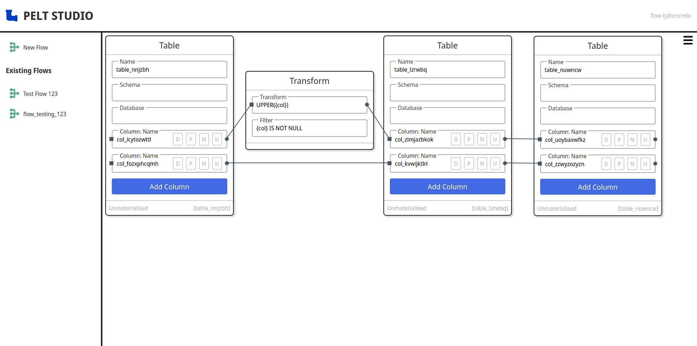
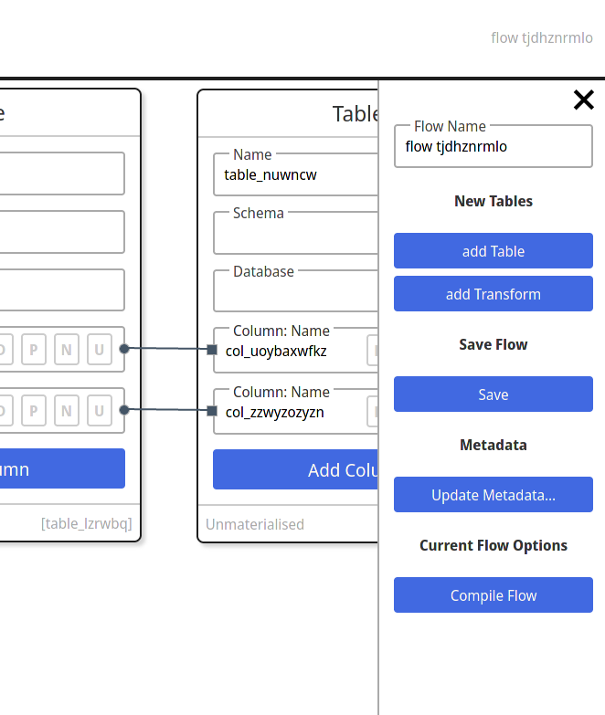

# PELT Studio

The **P**ython **E**xtract, **L**oad, **T**ransform Studio is an application for performing ELT (and ETL) tasks. Under the hood the application consists of a two parts. The Python back end: using SQLAlchemy for interfacing with traditional Relational Databases, FastAPI for exposing the logic to the fronend and Motor (async MongoDB client) for persisting the application configurations and database metadata. The front end is built using svelte and jsplumb.


The above diagram serves as a basic explaination of what the MVC for this app strives to achieve. Current progress is shown below:





## Status

**ALPHA! This applicaiton is still under development.**

If you are familiar with docker its trivial to set up a docker conatiner for this, however for now I'm keeping the files out of the repo to avoid having to update them as this is such an early stage of development.

I am currently also in the process of replacing the POC frontend implemented in react with a newer more maintainable version implemented in Svelte. This will eventually be renamed to peltstudio, but for now is called speltestudio (pelt + svelte. Yes, it's horrible but I couldnt think of anything else at the time).

There are a number of issues with the current implementation:

- lacks way to configure database connections from front end
- lacks way to view/configure join data for etl flows
- currently only supports one-to-one or more table data flows
  - one source table, to one or more target tables
  - no way to join selects, so cannot support merging data from two tables (yet)
  - all filters are joined using `and` so need better way to support more complex conditions
- need to build execution engine/transaction code
- need to test the current compilation code, as there appears to be issues in DAG
- a very large amount of refactoring 🤦

I'm a sole developer who works on this in my spare time. There is no current schedule for releases etc. I would love to see your issues/forks/PR's so please get involved!

## Usage

The usage instructions below are for usage during development. Proper packaging/deploying to come when closer to beta milestone.

```bash
# clone the repo and cd into it
git clone https://github.com/schlerp/pelt-studio.git
cd pelt-studio

# set up the python environment
python -m venv venv
source ./venv/bin/activate
python -m pip install -r requirements.txt

# start the api
python -m peltapi

# in another terminal, start the frontend
cd ./speltestudio
yarn      # to set up node_modules, can also use `npm install`
yarn dev  # to run the frontend, can also use `npm run dev`

# frontend: http://localhost:5000
# backend docs: http://localhost:8321/docs
```
